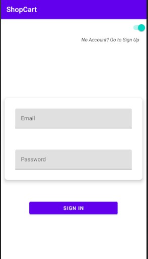
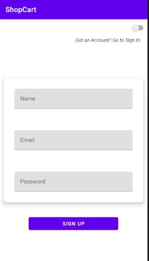
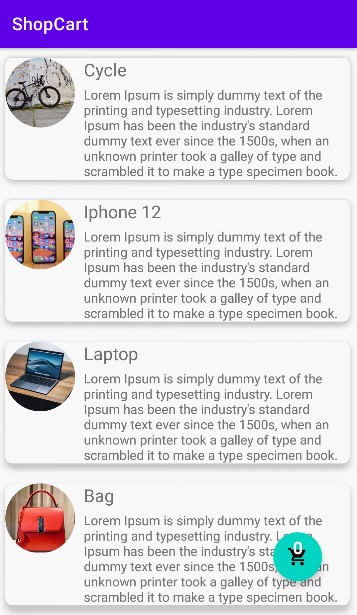
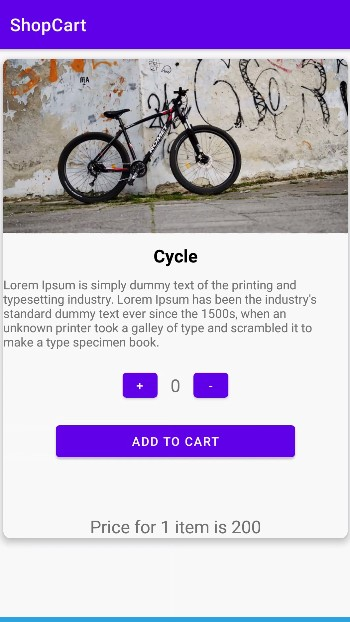
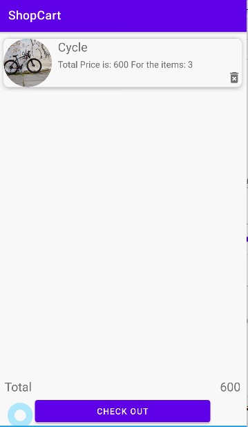

# ShoppingApp-Firestore-MVVM-Navigation
Shopping App built with Firestore - MVVM - Navigation

1. Added dummy products list into firestore. 
2. MVVM -fetches those products. 
3. Used Java methods to perform the sum of the arraylist to get the cart and total price quantities. 

YouTube Tutorial: 

# LOGIN FRAGMENT

# REGISTER FRAGMENT

# Products Fragment

# Product Detai Fragment

# Cart Fragment

